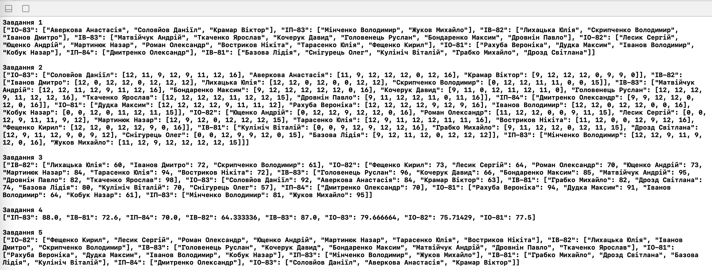
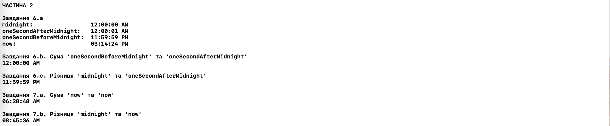

###### НАЦІОНАЛЬНИЙ ТЕХНІЧНИЙ УНІВЕРСИТЕТ УКРАЇНИ
###### “КИЇВСЬКИЙ ПОЛІТЕХНІЧНИЙ ІНСТИТУТ ІМЕНІ ІГОРЯ СІКОРСЬКОГО”
###### Факультет інформатики та обчислювальної техніки
###### Кафедра обчислювальної техніки

### Лабораторна робота №1.2
#### з дисципліни
### “Програмування мобільних систем”

Виконала:

студентка групи ІВ-82

ЗК ІВ-8206

Головаш Анастасія

Київ 2021

## Варіант № 1

(8206 mod 2) + 1 = 1

## Скріншот результатів виконання роботи




## Лістинг коду

```swift
import Foundation

// Частина 1

// Дано рядок у форматі "Student1 - Group1; Student2 - Group2; ..."

let studentsStr = "Дмитренко Олександр - ІП-84; Матвійчук Андрій - ІВ-83; Лесик Сергій - ІО-82; Ткаченко Ярослав - ІВ-83; Аверкова Анастасія - ІО-83; Соловйов Даніїл - ІО-83; Рахуба Вероніка - ІО-81; Кочерук Давид - ІВ-83; Лихацька Юлія - ІВ-82; Головенець Руслан - ІВ-83; Ющенко Андрій - ІО-82; Мінченко Володимир - ІП-83; Мартинюк Назар - ІО-82; Базова Лідія - ІВ-81; Снігурець Олег - ІВ-81; Роман Олександр - ІО-82; Дудка Максим - ІО-81; Кулініч Віталій - ІВ-81; Жуков Михайло - ІП-83; Грабко Михайло - ІВ-81; Іванов Володимир - ІО-81; Востриков Нікіта - ІО-82; Бондаренко Максим - ІВ-83; Скрипченко Володимир - ІВ-82; Кобук Назар - ІО-81; Дровнін Павло - ІВ-83; Тарасенко Юлія - ІО-82; Дрозд Світлана - ІВ-81; Фещенко Кирил - ІО-82; Крамар Віктор - ІО-83; Іванов Дмитро - ІВ-82"

// Завдання 1
// Заповніть словник, де:
// - ключ – назва групи
// - значення – відсортований масив студентів, які відносяться до відповідної групи

var studentsGroups: [String: [String]] = [:]

// MARK: - Ваш код починається тут

// Створення масиву з елементами у форматі "Student1 - Group1"
let studentsArray = studentsStr.components(separatedBy: ";")

studentsArray.forEach { student in
    
    // Масив типу ["Student1", "Group1"]
    let studentArray = student
        .replacingOccurrences(of: " - ", with: "v", options: .literal)
        .trimmingCharacters(in: .whitespaces)
        .components(separatedBy: "v")
    
    // Якщо уже була додана така група до словника
    if var arrayForGroup = studentsGroups[studentArray[1]] {
        arrayForGroup.append(studentArray[0])
        studentsGroups[studentArray[1]] = arrayForGroup
    } else {
        // Якщо такої групи ще немає у словнику
        studentsGroups[studentArray[1]] = [studentArray[0]]
    }
}

// MARK: - Ваш код закінчується тут

print("Завдання 1")
print(studentsGroups)
print()

// Дано масив з максимально можливими оцінками

let points: [Int] = [12, 12, 12, 12, 12, 12, 12, 16]

// Завдання 2
// Заповніть словник, де:
// - ключ – назва групи
// - значення – словник, де:
//   - ключ – студент, який відносяться до відповідної групи
//   - значення – масив з оцінками студента (заповніть масив випадковими значеннями, використовуючи функцію `randomValue(maxValue: Int) -> Int`)

func randomValue(maxValue: Int) -> Int {
    switch(arc4random_uniform(6)) {
    case 1:
        return Int(ceil(Float(maxValue) * 0.7))
    case 2:
        return Int(ceil(Float(maxValue) * 0.9))
    case 3, 4, 5:
        return maxValue
    default:
        return 0
    }
}

var studentPoints: [String: [String: [Int]]] = [:]

// MARK: - Ваш код починається тут

studentsGroups.forEach { group, students in
    
    var studentsWithMarks: [String: [Int]] = [:]
    
    students.forEach { student in

        var marks: [Int] = []
        points.forEach { max in
            marks.append(randomValue(maxValue: max))
        }
        studentsWithMarks[student] = marks
    }
    studentPoints[group] = studentsWithMarks
}

// MARK: - Ваш код закінчується тут

print("Завдання 2")
print(studentPoints)
print()

// Завдання 3
// Заповніть словник, де:
// - ключ – назва групи
// - значення – словник, де:
//   - ключ – студент, який відносяться до відповідної групи
//   - значення – сума оцінок студента

var sumPoints: [String: [String: Int]] = [:]

// MARK: - Ваш код починається тут

studentPoints.forEach { group, students in
    
    var studentsWithMarksSum: [String: Int] = [:]
    
    students.forEach { student, marks in
        studentsWithMarksSum[student] = marks.reduce(0, { $0 + $1 })
    }
    sumPoints[group] = studentsWithMarksSum
}

// MARK: - Ваш код закінчується тут

print("Завдання 3")
print(sumPoints)
print()

// Завдання 4
// Заповніть словник, де:
// - ключ – назва групи
// - значення – середня оцінка всіх студентів групи

var groupAvg: [String: Float] = [:]

// Ваш код починається тут

sumPoints.forEach { group, students in
        
    let sum = students.reduce(0, { $0 + $1.value })
    
    groupAvg[group] = Float(sum) / Float(students.count)
}

// MARK: - Ваш код закінчується тут

print("Завдання 4")
print(groupAvg)
print()

// Завдання 5
// Заповніть словник, де:
// - ключ – назва групи
// - значення – масив студентів, які мають >= 60 балів

var passedPerGroup: [String: [String]] = [:]

// MARK: - Ваш код починається тут

sumPoints.forEach { group, students in
        
    var groupstudents: [String] = []
    
    students.forEach { student, mark in
        if mark >= 60 {
            groupstudents.append(student)
        }
    }
    
    passedPerGroup[group] = groupstudents
}

// MARK: - Ваш код закінчується тут

print("Завдання 5")
print(passedPerGroup)


// MARK: -  Частина 2

final class TimeAH {
    
    // Class funcs
    
    class func emptyTimeDate() -> Date {
        
        let dateFormatter = DateFormatter()
        dateFormatter.dateFormat = "HH:mm:ss"
        return dateFormatter.date(from: "00:00:00")!
    }
    
    /// Завдання 7.a
    class func sum(_ lhs: TimeAH, _ rhs: TimeAH) -> TimeAH {
        var newDate = lhs.date()
        newDate.addTimeInterval(rhs.date().timeIntervalSince(TimeAH.emptyTimeDate()))
        return TimeAH(date: newDate)
    }
    
    /// Завдання 7.b
    class func difference(_ lhs: TimeAH, _ rhs: TimeAH) -> TimeAH {
        var newDate = lhs.date()
        newDate.addTimeInterval(-rhs.date().timeIntervalSince(TimeAH.emptyTimeDate()))
        return TimeAH(date: newDate)
    }
    
    // Properties
    
    let hours: UInt
    let minutes: UInt
    let seconds: UInt
    
    // Init
    
    /// Завдання 5.a & 5.b
    init(hours: UInt = 0, minutes: UInt = 0, seconds: UInt = 0) {
        
        self.hours = (0...23).contains(hours) ? hours : 0
        self.minutes = (0...59).contains(minutes) ? minutes : 0
        self.seconds = (0...59).contains(seconds) ? seconds : 0
    }
    
    /// Завдання 5.c
    init(date: Date) {
        
        let calendar = Calendar.current
        self.hours = UInt(calendar.component(.hour, from: date))
        self.minutes = UInt(calendar.component(.minute, from: date))
        self.seconds = UInt(calendar.component(.second, from: date))
    }
    
    // Private funcs
    
    private func date() -> Date {
        let dateFormatter = DateFormatter()
        dateFormatter.dateFormat = "HH:mm:ss"
        return dateFormatter.date(from: "\(hours):\(minutes):\(seconds)")!
    }
    
    // Public funcs
    
    /// Завдання 6.a
    public func time() -> String {
        let dateFormatter = DateFormatter()
        dateFormatter.dateFormat = "hh:​​mm:​​ss ​a"
        
        return dateFormatter.string(from: date())
    }
    
    /// Завдання 6.b
    public func sum(with item: TimeAH) -> TimeAH {

        var newDate = date()
        newDate.addTimeInterval(item.date().timeIntervalSince(TimeAH.emptyTimeDate()))
        return TimeAH(date: newDate)
    }
    
    /// Завдання 6.c
    public func difference(with item: TimeAH) -> TimeAH {
        
        var newDate = date()
        newDate.addTimeInterval(-item.date().timeIntervalSince(TimeAH.emptyTimeDate()))
        return TimeAH(date: newDate)
    }
}


print("\nЧАСТИНА 2")

let midnight = TimeAH()
let oneSecondAfterMidnight  = TimeAH(hours: 00, minutes: 00, seconds: 01)
let oneSecondBeforeMidnight  = TimeAH(hours: 23, minutes: 59, seconds: 59)
let now = TimeAH(date: Date())

let newTimeFromSum = oneSecondBeforeMidnight.sum(with: oneSecondAfterMidnight)
let newTimeFromDif = midnight.difference(with: oneSecondAfterMidnight)

let newTimeFromClassSum = TimeAH.sum(now, now)
let newTimeFromClassDif = TimeAH.difference(midnight, now)

// Вивід результатів

print("\nЗавдання 6.a")
print("midnight:                ", midnight.time())
print("oneSecondAfterMidnight:  ", oneSecondAfterMidnight.time())
print("oneSecondBeforeMidnight: ", oneSecondBeforeMidnight.time())
print("now:                     ", now.time())

print("\nЗавдання 6.b. Сума 'oneSecondBeforeMidnight' та 'oneSecondAfterMidnight'")
print(newTimeFromSum.time())

print("\nЗавдання 6.c. Різниця 'midnight' та 'oneSecondAfterMidnight'")
print(newTimeFromDif.time())

print("\nЗавдання 7.a. Сума 'now' та 'now'")
print(newTimeFromClassSum.time())

print("\nЗавдання 7.b. Різниця 'midnight' та 'now'")
print(newTimeFromClassDif.time())
```

## Висновок

Під час виконання даної лабораторної роботи було покращено знання мови програмування Swift.
